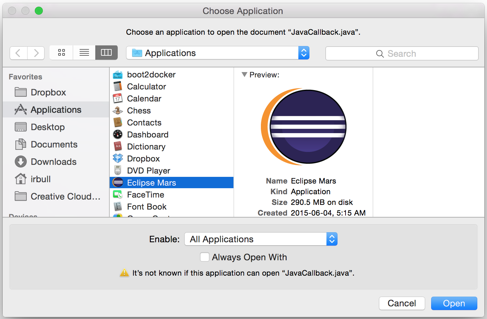
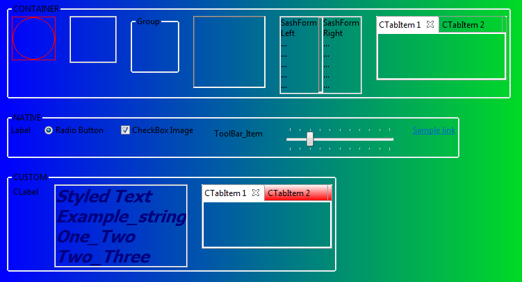
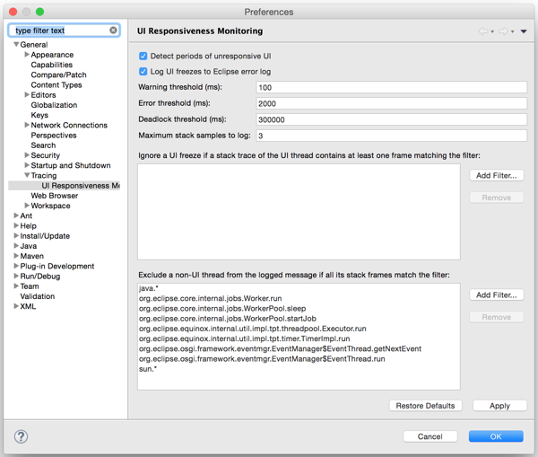
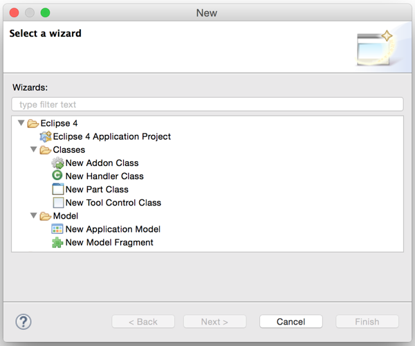
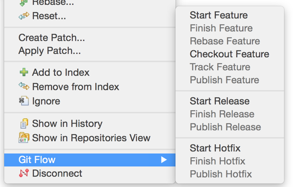
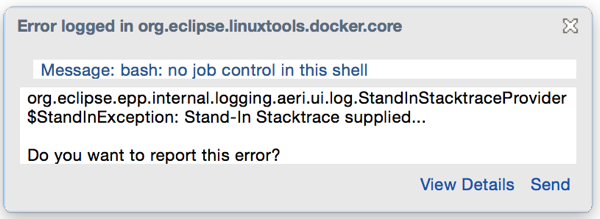
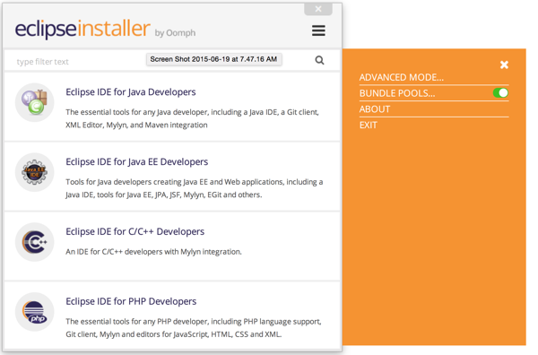

Top 10 Eclipse Mars Features
============================
[Eclipse Mars](http://www.eclipse.org/mars/) here! 10 years ago I became an Eclipse Committer and I've had the privilege of working with some of the best Software Developers in our industry. For 10 years I've watched the Eclipse team ship high quality software on-time and on-budget. Eclipse Mars contains 79 different Eclipse projects, 65 million lines of code, developed by 380 committers and 352 contributors.

Since 2007 I’ve been counting down the 10 most New and Noteworthy features of each release. These articles highlight the features I’m most excited about. Here is my list for 2015.

10. May Layout
--------------
While 10 years is a long time, some Eclipse feature requests last longer than that. In fact, since before I was a committer, since before I went to my first EclipseCon, and since before YouTube had its first video, the Eclipse community has been requesting a proper Mac Application for Eclipse.

This year Eclipse finally delivered, shipping the MacOS version as a proper Mac application. This means that Eclipse can be unzipped and dragged directly in your Application folder. With this change, installing Eclipse becomes much easier on Mac, and features like “open with” now work as expected.

[Read More...](http://eclipsesource.com/blogs/2015/06/11/mac-application-layout-top-eclipse-mars-feature-10/)

9. Platform Improvements
------------------------
The Eclipse platform is the core of all Eclipse based applications and plugins. Improvements to the platform benefit us all. There are a number of improvements to the core platform including an improved Dark Theme, crisper icons and proper transparency support in SWT.

[Read More...](http://eclipsesource.com/blogs/2015/06/12/platform-improvements-top-eclipse-mars-feature-9/)

8. UI Monitoring
----------------
From Mac’s spinning beach ball of death to Window’s unresponsive UI, user interface lags take developers out of the flow. We’ve all tried to fix the problem by clicking the mouse a little harder or hammering on the esc key; but as we all know, that doesn’t work. The only real fix is to understand what long-running task is blocking the UI thread.

With Eclipse Mars, debugging this just got a lot easier as Eclipse now ships with a UI Responsiveness Monitoring Tool. The tool can be configured to report instances of UI unresponsiveness.

[Read More...](http://eclipsesource.com/blogs/2015/06/15/ui-monitoring-top-eclipse-mars-feature-8/)

7. C/C++ Launching
------------------

6. e4 Tools
-----------
In 2012 Eclipse launched a new application model called e4. The application can be designed through a series of UI models, styled using CSS and dependencies are managed via DI.

This year, the Eclipse team has released the long awaited tooling for e4 as part of the simultaneous release. The Plug-in Development Environment (PDE) has a series of wizards and tools to help you create an Eclipse 4 application and editors to help you configure your models.

[Read More...](http://eclipsesource.com/blogs/2015/06/17/e4-tools-top-eclipse-mars-feature-6/)

5. JDT Improvements
-------------------

4. Docker Tools
---------------

3. Git Flow
-----------
Eclipse has shipped with Git support since 2011. While the tool has improved significantly over the years, many developers would still drop to the command line for custom tasks. One such example is the use of Git Flow. Git Flow is a branching model that places meaning on different branches. Each feature is developed in its own branch, and merged into a standard ‘develop’ branch. To perform a release, the ‘develop’ branch is merged into master. There are tools to help simplify this process.

With Eclipse Mars, there is now support for Git Flow directly from Eclipse.

[Read More...](http://eclipsesource.com/blogs/2015/06/22/git-flow-top-eclipse-mars-feature-3/)

2. Automatic Error Reporting
----------------------------
Instead of simply logging errors to the console, Eclipse can now report errors directly to the Eclipse committers; putting the information in the hands of those who can use it.

When the first error is encountered, Eclipse will notify you of the error and ask if you would like to opt-in.

When errors are detected, you will be prompted if you would like to send the details to eclipse.org. Committers will be able to create bug reports from the data, see similar incidents and help triage issues as they come in. Finally, if an issue has already been fixed, Eclipse will notify you and inform you of the version that contains the fix.

[Read More...](http://eclipsesource.com/blogs/2015/06/23/error-reporting-top-eclipse-mars-feature-2/)

1. Oomph Installer
------------------
This year Eclipse offers a completely new way to download and work with the IDE. Instead of downloading each package individually, the Eclipse installer by Oomph allows you to choose the installation you wish, and it will provision it for you.

You can choose _bundle pool_, to share Eclipse plugins between installations. This means that if you install another package, all the common bits will be shared. Finally, once Eclipse is started, you can walk through the Eclipse Welcome Questionnaire to set common Eclipse preferences to your liking.

[Read More...](http://eclipsesource.com/blogs/2015/06/24/top-10-eclipse-mars-features/)

Thank you to everyone involved with the Eclipse Mars release! For more Eclipse Tips and Tricks, you can follow me on [Twitter](https://twitter.com/irbull).
